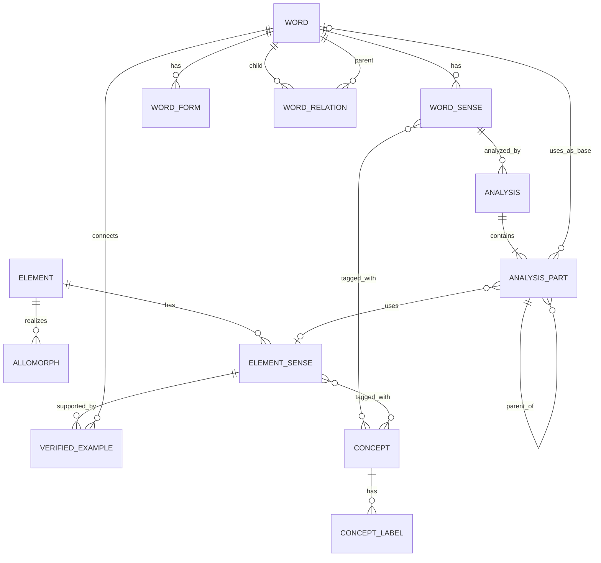

# Database Design

## 1. Physical storage decision

The project uses two mergeable static JSON layers.

- `data/catalog.json` is the canonical human-reviewed catalog for words, elements, concepts and sources.
- `data/imported-words.json` is a reproducible, source-linked draft lexicon generated from public dumps.
- PostgreSQL is not used because GitHub Pages has no server process.
- SQLite is not canonical because binary database files are difficult to diff and merge in Git.
- The browser merges both files and performs search locally.

There is no REST or GraphQL server API. The deployed JSON files are versioned static read assets, and `app.js` performs lookup in the browser. The ERD below is a logical model for those nested JSON records, not a physical relational database schema.

The refresh job now retains every record that satisfies the documented source rule instead of truncating an arbitrarily ranked top-N list. If payload size becomes impractical, the next step is sharding and generated indexes, not silently omitting qualified words.

## 2. Logical relationship model



## 3. Entities

### Word

A dictionary-level lemma. The same spelling may have multiple Word records when part of speech or etymology differs. Search groups those records into one visible lemma result while preserving the underlying records and part-of-speech labels.

Fields required for every Word:

- `id`
- `lemma`
- `partOfSpeech[]`
- `meanings[]`
- `forms[]`
- `relations[]`
- `analyses[]`
- `sources[]`
- `status`

Optional enrichment fields are `pronunciations[]`, `etymology`, `familyHeadwordId` and `familySummaryKo`. Reviewed records should populate them when evidence exists; draft imports may omit them rather than fabricate analysis.

### Word sense

A bilingual meaning belonging to one Word.

- `id`
- `ko[]`
- `en[]`
- `concepts[]`

### Word form

An inflection or spelling variant belonging to one Word.

- `form`
- `type`

Inflections are never stored as word relations. `ran` is a form of `run`; `runner` is a separate Word derived from `run`.

### Element

An abstract prefix, suffix, root or combining form.

- `id`
- `canonicalForm`
- `kind`
- `originLanguage`
- `bound`
- `allomorphs[]`
- `senses[]`

A spelling is not an ID. The same spelling can represent more than one linguistic element.

### Allomorph

A written realization of an Element. For example, `in-`, `im-`, `il-` and `ir-` are searchable surface forms associated with the project entry for `in-`.

- `form`
- `conditionKo`

### Element sense

One specific meaning or function of an Element.

- `id`
- `glossKo[]`
- `glossEn[]`
- `concepts[]`
- `function`
- `categoryChange`
- `productivity`
- `usageNoteKo`
- `etymologyNoteKo`
- `sources[]`
- `examples[]`: reviewed reverse links to words when a full spelling decomposition is unavailable
- optional `coverageWaiverKo`: editorial reason that fewer than two verified word links are temporarily acceptable

Each example records `wordId`, `mode` (`synchronic` or `etymological`) and a Korean review note. Analysis parts remain the strongest evidence; verified examples provide a navigable link without pretending that the whole word has been segmented. Spelling-only matches are computed separately in the browser and are never stored as verified graph edges.

Analysis parts reference an Element sense, not only an Element. This allows words to be grouped by the exact meaning in use.

### Analysis

A pedagogical, synchronic or etymological decomposition attached to one Word sense.

- `id`
- `wordSenseId`
- `mode`: `synchronic` or `etymological`
- `transparency`: `transparent`, `semi-transparent` or `opaque`
- `explanationKo`
- `parts[]`

### Analysis part

One surface segment in an Analysis.

- `order`
- `parentOrder`
- `surface`
- `role`
- exactly one of `elementSenseId` or `wordId`
- optional `boundaryChangeNote`

`parentOrder` supports nested structures. The first version displays parts linearly but preserves the field for tree rendering.

### Word relation

A directed edge from a derived Word to its parent Word.

- `type`
- `targetWordId`
- `transparency`
- `noteKo`

Family children are generated by reversing these edges. No manual family list is stored.

### Concept

A bilingual synonym set used for meaning search.

Example:

```json
{
  "id": "concept-negation",
  "labels": {
    "ko": ["부정", "아님", "반대"],
    "en": ["negation", "not", "opposite"]
  }
}
```

### Source

A source and licensing record. Every reviewed word and element sense must reference at least one Source.

## 4. Static read contract

The public read surface is:

```text
GET /data/catalog.json
GET /data/imported-words.json
```

These are complete file reads, not parameterized query endpoints. Stable IDs are the contract between files and routes. Search, filtering and joins run client-side. A write API, user accounts and server-side CRUD are intentionally out of scope for GitHub Pages.

## 5. Query paths

Resolve a form to its lemma:

```text
Word.forms.form → Word
```

Show a decomposition:

```text
Word → Word sense → Analysis → Analysis parts
```

Find all words using one Element sense:

```text
Element sense ← Analysis part ← Analysis ← Word
```

Build a word family:

```text
searched member → familyHeadwordId → family headword
family headword ← all words sharing familyHeadwordId
Word → relation parents
Word ← reversed relation children
```

`related-family` stores source-derived lexical-family evidence without asserting historical direction. `derived-from` is reserved for reviewed directional derivation.

Meaning search:

```text
query → Concept labels / Word-sense glosses / Element-sense glosses
```

## 6. Required invariants

1. Every ID is globally unique and immutable.
2. Every reference points to an existing record.
3. A reviewed sense has Korean and English glosses.
4. A reviewed word and Element sense has source attribution.
5. A Word form resolves to a Word, not to a family relation.
6. Analysis parts are ordered from 1 to n.
7. Each Analysis part references exactly one Element sense or base Word.
8. Concatenated Analysis surfaces equal the displayed lemma.
9. Spelling changes use the actual surface text and explain the change.
10. Derivation edges cannot point to the same Word.
11. Derivation cycles fail validation.
12. Search results and family groups are generated views, not canonical facts.

## 7. Search indexes

The browser currently builds lookup state from the two JSON assets and searches on explicit submission, not on every keystroke. Exact headword/form search and definition search are separate user intents so a missing headword is not replaced by arbitrary definition sentences.

As the full qualified corpus grows, CI should generate:

```text
form-to-word.json
allomorph-to-element.json
meaning-ko.json
meaning-en.json
element-sense-members.json
word-family.json
```

All lookup values must be arrays because homographs and identical allomorph spellings can resolve to multiple records.

## 8. Scale-up path

1. Split `catalog.json` into merge-friendly entity files.
2. Add claim-level Citation entities.
3. Build denormalized indexes in GitHub Actions.
4. Lazy-load detail records.
5. Use temporary SQLite only inside CI if joins become expensive.
6. Move to PostgreSQL only if accounts, server-side editing or a public write API are required.
